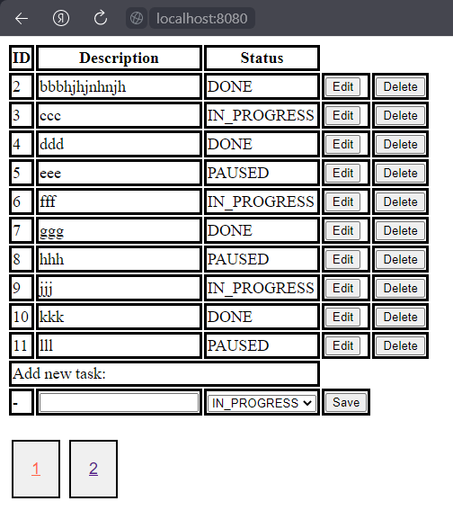

# todolist-springmvc

## Задача проекта
Создать простое приложение ToDo List, в котором можно добавлять, редактировать и удалять задачи.
Реализовать пагинацию для более удобного просмотра страниц со списком задач.

### Краткое описание
Есть реляционная БД `MySQL` с схемой (список задач, статус задачи) и простым начальным списком задач.
Для создания приложения будут использоваться следующие технологии `Hibernate`, `Spring MVC`, `Thymeleaf`, `Tomcat`,
`Docker`, `HTML/CSS/JS`.

### Краткое описание классов
В корневом пакете проекта `ru.demidov.todo` находятся 5 пакетов `config`, `controller`, `dao`, `domain`, `service`.
* пакет `config` содержит конфигурационные классы **AppConfig**, **MyWebAppInitializer** и **MyWebConfig**, которые в свою очередь
 содержат бины с конфигурациями настройки Spring MVC для управления транзакциями, соединения с БД и т.д
* пакет `controller` содержит классы **TaskController** и **TaskInfo** для работы с представлениями моделей в браузере
* пакет `dao` содержит специальный класс **TaskDAO** с методами CRUD для работы с соответствующей таблицей БД
* пакет `domain` содержит класс-перечисление **Status** и ентити-класс **Task** для мапинга соответствующих таблиц БД
* пакет `service` содержит класс **TaskService**, в котором размещена логика по созданию и редактированию задач

Также в основном пакете `main` содержаться следующие пакеты:
* `resources` c файлом, содержащим настройки фреймворка `p6spy`, который перехватывает и логгирует (регистрирует)
все данные из БД при транзакции
* `webapp`, который содержит шаблоны представления `html`, стили `css` и скрипты `js`

В корень самого приложения содержит ещё 2 файла для работы с `Docker` - это `Dockerfile` для соединения
с сервером `Tomcat` и файл `docker-compose`, в котором лежат настройки работы связки приложение - БД в docker-контейнерах

### Запуск приложения
Для запуска приложения необходимо:
* установить локально `Docker` и настроить его
* запустить `MySQL` сервер как докер-контейнер
* установить локально `Workbench` и создать новое соединение к БД, используя стандартный порт `3306`
* развернуть дамп в `Workbench`
* установить локально сервер `Tomcat`, подключить его в среде разработки `IntelliJ IDEA Ultimate`, используя хост `8080`
по умолчанию
* выполнить сборку приложения из терминала командой
```
mvn clean install`
```
* после успешной сборки упаковать приложение в docker-контейнер командой
```
docker compose up
```
после упаковки контейнер будет содержать 2 внутренних контейнера - это сервер и БД
* приложение доступно по адресу
```
http://localhost:8080/root
```

### Интерфейс программы


